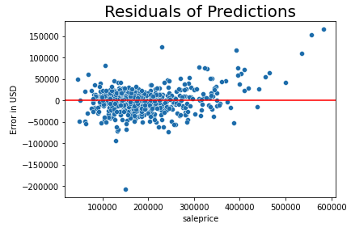
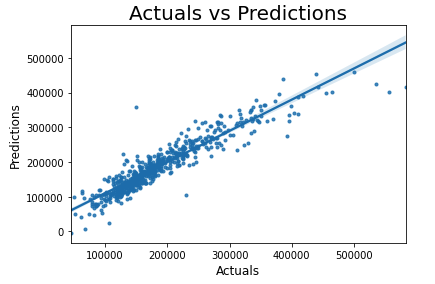

#  Project 2: Ames Iowa House Price Regression Challenge
Created by:  Stephen Strawbridge, Cohort #1019

### Overview and Background
Appraisal and valuation of a house price is not trivial by any means.  There are many factors or features that go into determining the final sale price of a house.  These features can be as basic as square footage, or as intricate as exact exterior style design of the house.  How can all of these features be accounted for during house appraisal?  Which features are more important than others?  How can we use data science (specifically, statistical regression models such as linear regression, Lasso, and Ridge models) for house appraisal?

### Problem Statement
We hypothesize that many home sellers/flippers, in the Iowa current market, are not valuing and listing home prices accurately because flippers are solely relying on market prices of similar houses.  This project aims to analyze the correlation between real estate price and it's features, as well as collinearity between it's features, to ensure that home flippers are accurately valuing their homes.

### Contents of Project
* <u>Notebook 1</u> - Contains data cleaning of the training file, exploratory data analysis of the features, data mapping, creation of dummy variables and feature engineering.
* <u>Notebook 2</u> - Contains data cleaning, data mapping, creation of dummy variables, and feature engineering of test file.
* <u>Notebook 3</u> - Contains fitting and modeling of training data, and then modeling of testing data.  Finally, conclusions are presented.
* <u>Datasets</u> - Contain 2 datasets as listed below, provided at beginning of project.  Also contains submission csv files that were submitted to the Kaggle competition.
* <u>Final Training and Testing CSV Files</u> - Contain the cleaned/modified training and testing files that are imported into Notebook 3 for modeling.
* <u>Images</u> - Contains two images used at the bottom of this README.

### Data Sets Used
1) Ames Iowa Housing File (a training csv version) - train.csv  
2) Ames Iowa Housing File (a testing csv version) - test.csv

### Key Features
For README presentation purposes, only the data dictionary for features used in this project can be found in the following link: ([*dictionary_link*](http://jse.amstat.org/v19n3/decock/DataDocumentation.txt))

### Overall Process
#### The following steps can be seen in Notebook 1
* 1) *Data Cleaning* - Like many datasets, the datasets required cleaning in multiple columns.  Standard cleaning procedures, such as fill nulls and change datatypes of certain columns were performed.  Most importantly, cleaning for object columns involved filling nulls with a "None" string, while filling nulls in numerical columns involved replacing nulls with either 0, or in some cases, the mean value of the numerical column.

* 2) *Exploratory Data Analysis (EDA)* - First, summary statistics and the distribution of our dependent variable (sale price) was found.  This distribution was important to keep in mind, as the distribution of our predictions would likely be very similar. Use of Seaborn Heatmaps was crucial for EDA in this project, as correlation between features with sale price, and correlation between features with other features, were critical concepts for developing the regression models.  Lastly, it is important to note that there were two clear outliers in our dataset, which were discovered when using a scatterplot to visualize the relationship between sale price and ground living area.  These outliers were removed to better fit our training model, as they were obvious exceptions to the general relationship between these two variables.

* 3) *Data mapping, dummifying, and feature engineering* - Data mapping was used for ordinal features, such as basement quality, fireplace quality, or garage condition.  Using the data dictionary, a numerical scale was assigned to each quality (for example, 'Excellent' = 5 while 'Poor' = 3 or less).  Dummification was used on categorical features that seemed to be most relevant to our model.  Lastly, and perhaps most importantly, feature engineering was used to create multiple new features for our model.  The main engineered features in the model used for this project were "general quality condition" (combination of multiple quality and condition features), "total square footage" (aggregate number of square footage across multiple areas and rooms of the house), and "how new" (which combined the year built and/or year remodeled together).  These engineered features proved to have about a 65-89% correlation with sale price.

#### The following step can be seen in Notebook 2
* 4) Per project instructions, the testing data file needed to be formatted in the same exact manner as the training data file, but no rows could be dropped (such as any outliers).  Step 1 and Step 3 described above were performed on the testing data file, without dropping any rows.  At the end of this notebook, any unique dummified columns between the training and testing datafiles were dropped so that modeling could be properly performed in Notebook 3.

#### The following steps can be seen in Notebook 3
* 4) After importing necessary sklearn packages and cleaned/engineered training and testing datafiles, the training file was split into X (features matrix) and Y (saleprice vector).  The training file already had all the features desired for the model, but saleprice and id needed to be dropped.  A test size of 30% was used for the split, which was slightly higher than the default.  30% was used as I desired a more even ratio between training and test data, and this proved to obtain better scores. See summary of analysis section below for results and analysis of modeling our data using linear regression, Lasso, and Ridge.

### Summary of Analysis
Overall the linear regression performed the best, with a testing r-squared of 87.06% and a RMSE of about 25,980.  For Lasso and Ridge, r-squared was slightly lower and RMSE was about 27,800.  Note that our data was scaled/transformed for our Lasso and Ridge model, but not for our linear regression model.  Finally, the baseline RMSE was about 77,700.  Visualizations of results are seen below:

 

### Conclusions, Recommendations, and Limitations
At the end of the modeling process, it can be seen that the linear regression outperformed the LASSO and ridge regressions, but only by a slight amount.  All three regressions far outperformed the baseline model.  Therefore, using data science and regressions is far more advantageous than just solely relying on market prices for similar houses! For our model specifically, finding correlation between housing features of total square footage, overall quality, and age of the house proved to be strong engineered features. Outliers also had a significant impact on the regression scores (several percentages in r-squared), which could indicate that market prices are not always reliable in a market with some buyers acting as outliers.  It is also noteworthy to add that although common intuition was helpful in deciding which features to engineer, using heatmaps was the most accurate and efficient way to engineer.

*Key Takeaways, Recommendations, and Limitations*:  On the linear regression model, I could have tried to eliminate the few large errors, as evidenced on the residuals visuals scatterplots.  There may have been additional outliers in the data that went unnoticed during my EDA causing these large errors.  I also believe that the LASSO (and Ridge) model could have performed better had I performed trial and error on the model's parameters.  It is likely I did not reach the full potential of the LASSO or Ridge models when using the alpha hyper-parameters.
